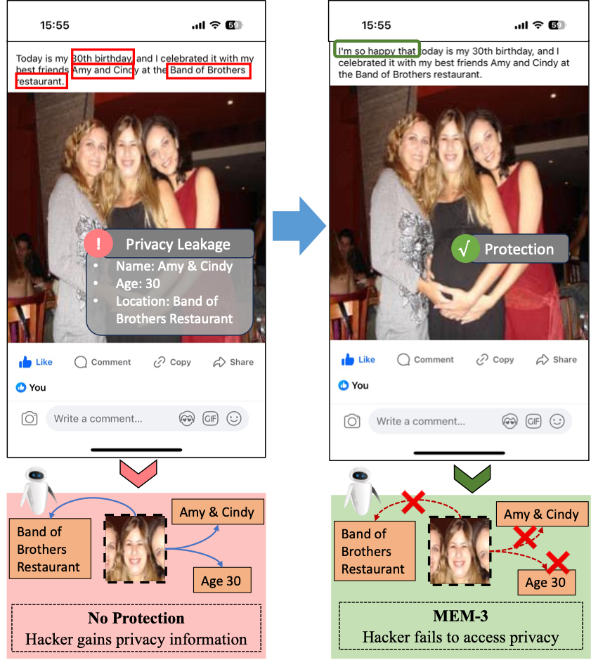

# Multimodal Unlearnable Examples: Protecting Data against Multimodal Contrastive Learning (ACM MM2024)

**Abstract**: Multimodal contrastive learning (MCL) has shown remarkable advances in zero-shot classification by learning from millions of image-caption pairs crawled from the Internet. However, this reliance poses privacy risks, as hackers may unauthorizedly exploit image-text data for model training, potentially including personal and privacy-sensitive information. Recent works propose generating unlearnable examples by adding imperceptible perturbations to training images to build shortcuts for protection. However, they are designed for unimodal classification, which remains largely unexplored in MCL. We first explore this context by evaluating the performance of existing methods on image-caption pairs, and they do not generalize effectively to multimodal data and exhibit limited impact to build shortcuts due to the lack of labels and the dispersion of pairs in MCL. In this paper, we propose Multi-step Error Minimization (MEM), a novel optimization process for generating multimodal unlearnable examples. It extends the Error-Minimization (EM) framework to optimize both image noise and an additional text trigger, thereby enlarging the optimized space and effectively misleading the model to learn the shortcut between the noise features and the text trigger. Specifically, we adopt projected gradient descent to solve the noise minimization problem and use HotFlip to approximate the gradient and replace words to find the optimal text trigger. Extensive experiments demonstrate the effectiveness of MEM, with post-protection retrieval results nearly half of random guessing, and its high transferability across different models.




## Requirements
Our code relies on the [CleanCLIP](https://github.com/nishadsinghi/CleanCLIP) source code.

- Both Linux and Windows are supported, but we strongly recommend Linux for performance and compatibility reasons.
- 64-bit Python 3.7+ installation.

## Setup Environment and Install dependencies


### Conda (recommended)

Please follow the instructions at the following link to set up
anaconda: [Anaconda Setup](https://docs.anaconda.com/anaconda/install/index.html)

The following commands create a conda environment inside the repository with the dependencies.

```bash
conda env create --prefix ./env -f environment.yml
source activate ./env
```

### Pip

The requirements can be directly installed without creating a conda environment.

```bash
pip install -r requirements.txt
```
## Dataset
We have already divided these dataset with training set, validation set and testing set. And the divided results can be found like in ~/Data/Dataset/train.csv .

### Flickr8k
Flickr 8k dataset contains 8092 images and up to five captions for each image. The dataset can be downloaded [here](https://www.kaggle.com/datasets/adityajn105/flickr8k).

### Flickr30k
The Flickr30k dataset contains 31,000 images collected from Flickr, together with 5 reference sentences provided by human annotators. The dataset can be downloaded [here](https://www.kaggle.com/datasets/hsankesara/flickr-image-dataset).

### MSCOCO

The dataset can be downloaded [here](https://www.kaggle.com/datasets/awsaf49/coco-2017-dataset).


## Generate Multimodal Unlearnable Examples
### Clean Training with Flick8K
```
python -m src.main --name clean_flick8k --train_data /data/clip/Flicker-8k/train.csv --eval_test_data_dir /data/clip/Flicker-8k/test.csv --image_key images  --caption_key caption  --device_id 0
```


### Protecting Multimodal Unlearnable Examples (MEM)

set the text trigger length as 3
```
python -m src.poison --name poison_token_3_shuffle --train_data /data/clip/Flicker-8k/train.csv  --image_key images  --caption_key caption  --device_id 0 --token_num 3 --lr 1e-4 
```

set the text trigger length as 5
```
python -m src.poison --name poison_token_5_shuffle --train_data /data/clip/Flicker-8k/train.csv  --image_key images  --caption_key caption  --device_id 1 --token_num 5 --lr 1e-4
```

### Evaluating Performance 

```
python -m src.poison_main --name eval_token_3_shuffle --train_data /data/clip/Flicker-8k/train.csv --eval_test_data_dir /data/clip/Flicker-8k/test.csv --image_key images  --caption_key caption  --device_id 0 --save_pert poison_token_3_shuffle --token_num 3  --lr 5e-4
```

```
python -m src.poison_main --name eval_token_5_shuffle --train_data /data/clip/Flicker-8k/train.csv --eval_test_data_dir /data/clip/Flicker-8k/test.csv --image_key images  --caption_key caption  --device_id 1 --save_pert poison_token_5_shuffle --token_num 5  --lr 5e-4
```

## Acknowledgements

Some portions of the code in this repository are adaptations from the following repositories: [CleanCLIP](https://github.com/nishadsinghi/CleanCLIP), [openai](https://github.com/openai/CLIP) and [universal-triggers](https://github.com/Eric-Wallace/universal-triggers).